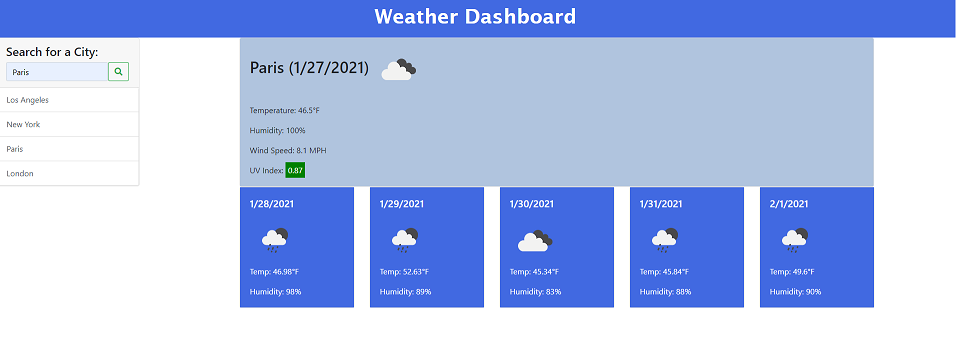

# weather-dashboard

## Description

In this project, I built a weather dashboard that runs in a browser and features dynamically updated HTML and CSS. A user can enter multiple cities to see their weather outlooks.

## Functionality

* point 1
* point 2
* point 3
* point 4
* point 5

## Installation

This project requires the following files and folders:

* index.html
* assests/js/script.js
* assets/css/style.css

## Deployed Website

[Weather Dashboard Website](https://johannaleal.github.io/weather-dashboard/)

## Repository

[Repository](https://github.com/johannaleal/weather-dashboard)

## Index.html Screenshot

